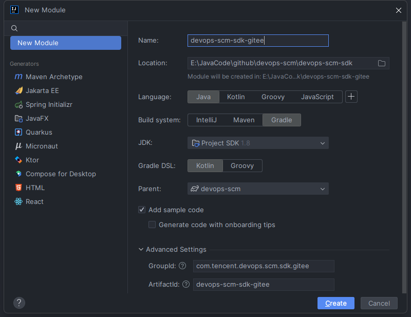
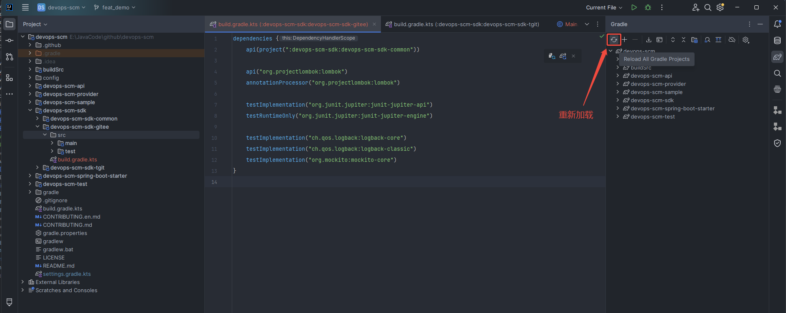
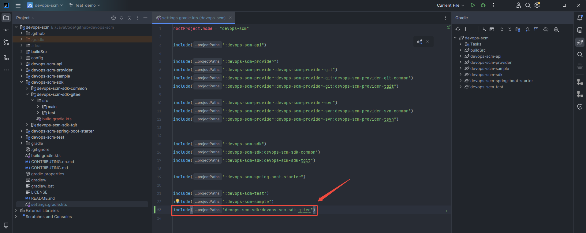
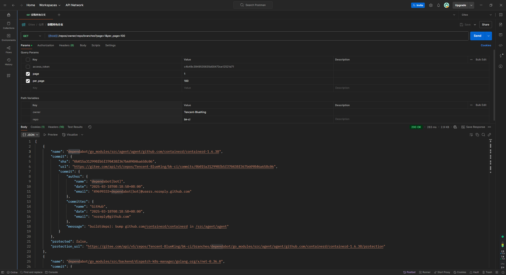
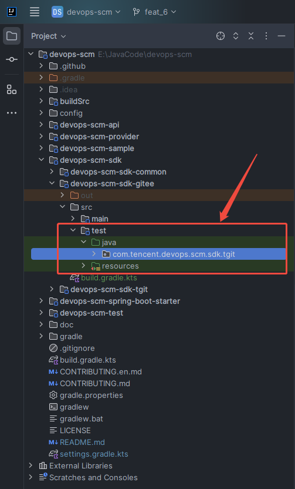
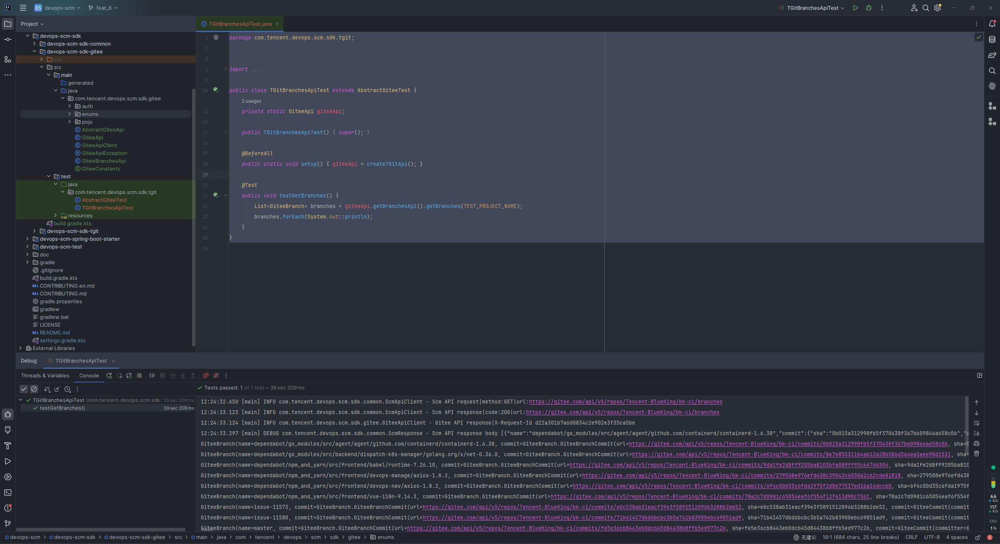

# 新增源码管理平台

当前版本已内置支持腾讯TGIT代码库，如需集成其他源码管理平台（如Gitee、GitHub等），请按照以下规范进行扩展开发。本文将以Gitee社区版为例，基于IDEA编译器，演示完整的对接流程。

参考：[项目结构介绍](./PROJECT_STRUCTURE.md)

## 1.指定服务提供者标识
````java
/**
 * 源码管理平台提供者
 */
public enum ScmProviderCodes {
    TGIT("tgit"),
    TSVN("tsvn"),
    GITHUB("github"),
    GITLAB("gitlab"),
    // 增加Gitee提供者标识
    GITEE("gitee"),
    ;
    public final String value;

    ScmProviderCodes(String value) {
        this.value = value;
    }

    @JsonValue
    public String toValue() {
        return value;
    }

    @Override
    public String toString() {
        return value;
    }
}
````

## 2. 服务对接模块开发
### 2.1 初始化模块
### 2.1.1 增加 devops-scm-sdk-gitee 模块
基于[devops-scm-sdk]目录右键 'New' -> 'Module', 填入module相关配置，module名应与提供者标识保持一致，注意module所在位置，防止module不被识别



### 2.1.2 调整 build.gradle.kts
module 新建后需调整对应的 build.gradle.kts 文件, 引用父模块相关依赖, 确保全局依赖版本一致
````
dependencies {
    api(project(":devops-scm-sdk:devops-scm-sdk-common"))
    api("org.projectlombok:lombok")
    annotationProcessor("org.projectlombok:lombok")

    testImplementation("org.junit.jupiter:junit-jupiter-api")
    testRuntimeOnly("org.junit.jupiter:junit-jupiter-engine")

    testImplementation("ch.qos.logback:logback-core")
    testImplementation("ch.qos.logback:logback-classic")
    testImplementation("org.mockito:mockito-core")
}
````
build.gradle.kts 修改完成后, 重新加载gradle项目


重新加载后如果左侧项目列表无法正常加载 devops-scm-sdk-gitee 模块，请检查 settings.gradle.kts 配置，确保
devops-scm-sdk-gitee 模块被正常导入


### 2.2 常量定义
为了方便后续接口调用，先对常用的接口常量进行提取，如：
- 分页参数名
- 授权参数名
- 授权类型（非固定，需提前了解服务端支持的授权类型）

````java
package com.tencent.devops.scm.sdk.gitee;

public interface GiteeConstants {

    /**
     * 每页的项目数
     */
    String PER_PAGE_PARAM = "per_page";

    /**
     * 当前页面的索引 (从 1 开始)
     */
    String PAGE_PARAM = "page";

    /**
     * OAuth2 授权请求头KEY
     */
    String OAUTH_TOKEN_HEADER = "Authorization";

    /**
     * 请求结果中的响应头 - 数据总条数
     */
    String TOTAL_HEADER = "total_count";

    /**
     * 请求结果中的响应头 - 数据总页数
     */
    String TOTAL_PAGES_HEADER = "total_page";

    /**
     * 默认页
     */
    int DEFAULT_PAGE = 1;

    /**
     * 每页默认数
     */
    int DEFAULT_PER_PAGE = 100;

    public enum TokenType {
        OAUTH2_ACCESS, PERSONAL_ACCESS;
    }
}

````

### 2.3 增加授权提供者
为保障系统安全性，调用Gitee服务端API接口需进行身份认证。现针对Gitee社区版平台开发了授权提供者模块，当前版本支持以下两种授权机制：
- Oauth Access Token
- Personal Access Token

在 devops-scm-sdk-gitee 模块下新建 GiteeTokenAuthProvider 类，用于实现 HTTP 授权认证接口

````java
package com.tencent.devops.scm.sdk.gitee.auth;

import static com.tencent.devops.scm.sdk.gitee.GiteeConstants.OAUTH_TOKEN_HEADER;

import com.tencent.devops.scm.sdk.common.ScmRequest;
import com.tencent.devops.scm.sdk.common.auth.HttpAuthProvider;
import com.tencent.devops.scm.sdk.gitee.GiteeConstants;

/**
 * token授权,token包含oauth2_token、personal_access_token
 */
public class GiteeTokenAuthProvider implements HttpAuthProvider {

  private final String authHeader;
  private final String authToken;

  public GiteeTokenAuthProvider(String authHeader, String authToken) {
    this.authHeader = authHeader;
    this.authToken = authToken;
  }

  public static GiteeTokenAuthProvider fromOauthToken(String oauthAccessToken) {
    return new GiteeTokenAuthProvider(OAUTH_TOKEN_HEADER, oauthAccessToken);
  }

  public static GiteeTokenAuthProvider fromPersonalAccessToken(String privateToken) {
    return new GiteeTokenAuthProvider(OAUTH_TOKEN_HEADER, privateToken);
  }

  public static GiteeTokenAuthProvider fromTokenType(GiteeConstants.TokenType tokenType, String authToken) {
    String authHeaderValue = "token " + authToken;
    switch (tokenType) {
      case PERSONAL_ACCESS:
        return fromPersonalAccessToken(authHeaderValue);
      case OAUTH2_ACCESS:
        return fromOauthToken(authHeaderValue);
      default:
        throw new UnsupportedOperationException(String.format("tokenType(%s) is not support", tokenType));
    }
  }

  @Override
  public void authorization(ScmRequest.Builder<?> builder) {
    builder.setHeader(authHeader, authToken);
  }
}
````

### 2.4 增加通讯客户端
为提高代码复用性和可维护性，在此对服务端通信请求中的重复性操作进行了统一封装和标准化处理，主要包括以下内容：
- 请求的前置后置处理
- 授权信息注入
- 统一异常处理

在 [com.tencent.devops.scm.sdk.gitee] 包下增加3个基础工具类

````java
// 工具类 1: AbstractGiteeApi
package com.tencent.devops.scm.sdk.gitee;

/**
 * 作用：Gitee API的抽象基类，提供公共功能
 * 核心功能：
 *   - 封装项目ID/路径的转换逻辑（getProjectIdOrPath）
 *   - 提供URL编码工具方法（urlEncode）
 */
public class AbstractGiteeApi implements GiteeConstants {

    protected final GiteeApi giteeApi;

    public AbstractGiteeApi(GiteeApi giteeApi) {
        this.giteeApi = giteeApi;
    }

    /**
     * 转换obj对象获取项目ID或者仓库名
     *
     * @param obj 仓库ID/仓库名/TGitProject对象
     * @return 项目ID或仓库名
     */
    public String getProjectIdOrPath(Object obj) {
        if (obj == null) {
            throw new TGitApiException("Cannot determine ID or path from null object");
        } else if (obj instanceof String) {
            return (String) obj;
        } else {
            throw new TGitApiException("Cannot determine ID or path from provided " + obj.getClass().getSimpleName()
                    + " instance, must be Integer, String, or a Project instance");
        }
    }

    protected String urlEncode(String s) {
        return UrlEncoder.urlEncode(s);
    }
}
````
````java
// 工具类 2: GiteeApiClient 继承 com.tencent.devops.scm.sdk.common.ScmApiClient
package com.tencent.devops.scm.sdk.gitee;

import static java.net.HttpURLConnection.HTTP_BAD_REQUEST;
import static java.net.HttpURLConnection.HTTP_INTERNAL_ERROR;

import com.tencent.devops.scm.sdk.common.ScmApiClient;
import com.tencent.devops.scm.sdk.common.ScmRequest;
import com.tencent.devops.scm.sdk.common.auth.HttpAuthProvider;
import com.tencent.devops.scm.sdk.common.connector.ScmConnector;
import com.tencent.devops.scm.sdk.common.connector.ScmConnectorRequest;
import com.tencent.devops.scm.sdk.common.connector.ScmConnectorResponse;
import com.tencent.devops.scm.sdk.common.connector.ScmConnectorResponseErrorHandler;
import com.tencent.devops.scm.sdk.common.exception.ScmHttpRetryException;
import com.tencent.devops.scm.sdk.common.util.ScmJsonUtil;
import com.tencent.devops.scm.sdk.common.util.ScmSdkJsonFactory;
import org.slf4j.Logger;
import org.slf4j.LoggerFactory;

/**
 * HTTP客户端实现，负责与Gitee API服务器的底层通信
 * 核心功能：
 *    - 管理API请求认证（通过HttpAuthProvider）
 *    - 处理请求前后的拦截逻辑（beforeRequest/afterRequest）
 *    - 统一异常处理（handleException）
 *    - 实现错误响应处理（通过内部类TGitConnectorResponseErrorHandler）
 */
public class GiteeApiClient extends ScmApiClient {

  private static final Logger logger = LoggerFactory.getLogger(GiteeApiClient.class);
  private final HttpAuthProvider authorizationProvider;

  public GiteeApiClient(String apiUrl, ScmConnector connector, HttpAuthProvider authorizationProvider) {
    super(apiUrl, connector);
    this.authorizationProvider = authorizationProvider;
  }

  @Override
  public void beforeRequest(ScmRequest originRequest, ScmRequest.Builder<?> builder) {
    authorizationProvider.authorization(builder);
  }

  @Override
  public void afterRequest(ScmConnectorResponse connectorResponse, ScmRequest request) {
    String traceId = connectorResponse.header("X-Request-Id");
    logger.info("Gitee API response|X-Request-Id {}", traceId);
    ScmConnectorResponseErrorHandler errorHandler = new GiteeConnectorResponseErrorHandler();
    if (errorHandler.isError(connectorResponse)) {
      errorHandler.onError(connectorResponse);
    }
  }

  @Override
  public ScmSdkJsonFactory getJsonFactory() {
    return ScmJsonUtil.getJsonFactory();
  }

  @Override
  public RuntimeException handleException(
          Exception e, ScmConnectorRequest connectorRequest, ScmConnectorResponse connectorResponse) {
    if (e instanceof GiteeApiException) {
      return (GiteeApiException) e;
    } else {
      return new GiteeApiException(e, connectorResponse);
    }
  }

  static class GiteeConnectorResponseErrorHandler implements ScmConnectorResponseErrorHandler {

    @Override
    public Boolean isError(ScmConnectorResponse connectorResponse) {
      return connectorResponse.statusCode() >= HTTP_BAD_REQUEST;
    }

    @Override
    public void onError(ScmConnectorResponse connectorResponse) {
      int statusCode = connectorResponse.statusCode();
      // 如果服务异常或者请求限流,则重试
      if (statusCode > HTTP_INTERNAL_ERROR || statusCode == 429) {
        throw new ScmHttpRetryException();
      } else {
        throw new GiteeApiException(connectorResponse);
      }
    }
  }
}
````
````java
package com.tencent.devops.scm.sdk.gitee;

import com.tencent.devops.scm.sdk.common.Requester;
import com.tencent.devops.scm.sdk.common.auth.HttpAuthProvider;
import com.tencent.devops.scm.sdk.common.connector.ScmConnector;
import lombok.Getter;

/**
 * Gitee API入口类，提供所有Gitee API功能的统一访问点
 * 核心功能：
 *      -管理各种API子模块的懒加载（如项目、仓库、分支等API）
 *      -使用双重检查锁实现线程安全的单例模式
 *      -提供统一的请求构造器（createRequest）
 */
public class GiteeApi {
  @Getter
  private final GiteeApiClient client;

  public GiteeApi(GiteeApiClient client) {
    this.client = client;
  }

  public GiteeApi(String apiUrl, ScmConnector connector, HttpAuthProvider authorizationProvider) {
    this.client = new GiteeApiClient(apiUrl, connector, authorizationProvider);
  }

  Requester createRequest() {
    return new Requester(client);
  }
}
````
### 2.5 核心接口实现
本节以 [仓库分支管理] 为例，演示如何实现Gitee平台API对接，主要包含以下步骤：

- step1. 接口数据结构分析

  使用Postman等工具调用 [获取所有分支](https://gitee.com/api/v5/swagger#/getV5ReposOwnerRepoBranches) 接口

  

  根据以上返回的数据结构提取成对应的java实体类（非必要字段可忽略）
  ````java
    @Data
    public class GiteeBranch {
        private String name;
        private GiteeBranchCommit commit;
        @JsonProperty("protected")
        private Boolean protectedBranch;
        @JsonProperty("protection_url")
        private Boolean protectionUrl;

        @Data
        class GiteeBranchCommit {
            private String url;
            private String sha;
            private GiteeCommit commit;
        }
    }
  
    @Data
    public class GiteeAuthor {
        private String name;
        private String email;
    }
  
    @Data
    public class GiteeCommit {
        private GiteeAuthor committer;
        private GiteeAuthor author;
        private String message;
    }
  ````

- step2. 创建 GiteeBranchesApi 类继承 AbstractGiteeApi 基类，实现 [获取分支列表](https://gitee.com/api/v5/swagger#/getV5ReposOwnerRepoBranches) 接口功能
  ````java
  package com.tencent.devops.scm.sdk.gitee;

  import com.tencent.devops.scm.sdk.common.ScmHttpMethod;
  import com.tencent.devops.scm.sdk.common.ScmRequest.Builder;
  import com.tencent.devops.scm.sdk.common.enums.SortOrder;
  import com.tencent.devops.scm.sdk.gitee.enums.GiteeBranchOrderBy;
  import com.tencent.devops.scm.sdk.gitee.pojo.GiteeBranch;
  import java.util.Arrays;
  import java.util.List;
  
  public class GiteeBranchesApi extends AbstractGiteeApi {
  
      /**
       * 分支请求uri
       * 作用: 组装请求连接，后续会携带到请求头[URI_PATTERN]里面，集成springboot后可用于上报度量信息
       * 参考：
       * @see Builder#withUriPattern(String)
       * com.tencent.devops.scm.spring.config.ScmConnectorConfiguration#okHttpMetricsEventListener
       * io.micrometer.core.instrument.binder.okhttp3.OkHttpMetricsEventListener.Builder#uriMapper
       */
      private static final String BRANCHES_URI_PATTERN = "repos/:fullName/branches";
  
      public GiteeBranchesApi(GiteeApi tGitApi) {
          super(tGitApi);
      }
  
      /**
       * 获取分支列表
       * @param projectIdOrPath 仓库名
       */
      public List<GiteeBranch> getBranches(Object projectIdOrPath) {
          return getBranches(projectIdOrPath, null, null);
      }
  
      /**
       * 获取分支列表
       * @param projectIdOrPath 仓库名
       * @param page 当前的页码
       * @param perPage 每页的数量，最大为 100
       */
      public List<GiteeBranch> getBranches(
              Object projectIdOrPath,
              Integer page,
              Integer perPage
      ) {
          return getBranches(projectIdOrPath, page, perPage, null, null);
      }
  
      /**
       * 获取分支列表
       * @param projectIdOrPath 仓库名
       * @param page 当前的页码
       * @param perPage 每页的数量，最大为 100
       * @param orderBy 排序字段 
       * @param sort 排序方向
       */
      public List<GiteeBranch> getBranches(
              Object projectIdOrPath,
              Integer page,
              Integer perPage,
              GiteeBranchOrderBy orderBy,
              SortOrder sort
      ) {
          String repoId = getProjectIdOrPath(projectIdOrPath);
          String urlPath = String.format(BRANCHES_URI_PATTERN, repoId);
          GiteeBranch[] branches = giteeApi.createRequest()
                  .method(ScmHttpMethod.GET)
                  .withUrlPath(
                          BRANCHES_URI_PATTERN,
                          MapBuilder.<String, String>newBuilder()
                                  .add("fullName", repoId)
                                  .build()
                  )
                  .withRepoId(repoId)
                  .with(PAGE_PARAM, page)
                  .with(PER_PAGE_PARAM, perPage)
                  .with("sort", orderBy != null ? orderBy.toValue() : null)
                  .with("direction", sort != null ? sort.getValue() : null)
                  .fetch(GiteeBranch[].class);
          return Arrays.asList(branches);
      }
  }
  ````
  - step3. 将 GiteeBranchesApi 挂载到 GiteeApi 进行统一管理
  ````java
  public class GiteeApi {
    @Getter
    private final GiteeApiClient client;
    private volatile GiteeBranchesApi branchesApi;

    public GiteeApi(GiteeApiClient client) {
        this.client = client;
    }

    public GiteeApi(String apiUrl, ScmConnector connector, HttpAuthProvider authorizationProvider) {
        this.client = new GiteeApiClient(apiUrl, connector, authorizationProvider);
    }

    Requester createRequest() {
        return new Requester(client);
    }

    public GiteeBranchesApi getBranchesApi() {
        if (branchesApi == null) {
            synchronized (this) {
                if (branchesApi == null) {
                    branchesApi = new GiteeBranchesApi(this);
                }
            }
        }
        return branchesApi;
    }
  }
  ````
  
### 2.6 接口验证测试
接口实现后，增加测试类，对 GiteeBranchesApi 进行测试，此处没有核心业务，直接使用即可
- step1. [devops-scm-sdk-gitee/src] 文件夹下增加 test 文件夹

    

- step2. 补充测试类
  ````java
  package com.tencent.devops.scm.sdk.tgit;
        
  import com.fasterxml.jackson.core.type.TypeReference;
  import com.tencent.devops.scm.sdk.common.auth.HttpAuthProvider;
  import com.tencent.devops.scm.sdk.common.connector.ScmConnector;
  import com.tencent.devops.scm.sdk.common.connector.okhttp3.OkHttpScmConnector;
  import com.tencent.devops.scm.sdk.common.util.ScmJsonUtil;
  import com.tencent.devops.scm.sdk.gitee.GiteeApi;
  import com.tencent.devops.scm.sdk.gitee.auth.GiteeTokenAuthProvider;
  import java.io.File;
  import java.io.IOException;
  import java.nio.charset.StandardCharsets;
  import okhttp3.OkHttpClient;
  import org.apache.commons.io.FileUtils;
  import org.mockito.Mockito;
  
  /**
   * 基础的gitee测试类
   */
  public class AbstractGiteeTest {
      // 测试仓库
      protected static final String TEST_PROJECT_NAME = "Tencent-BlueKing/bk-ci";
      // 测试分支名
      protected static final String TEST_DEFAULT_BRANCH = "master";
      // [环境变量KEY]接口地址
      protected static final String TEST_TGIT_API_URL = "TEST_GITEE_API_URL";
      // [环境变量KEY]授权token
      protected static final String TEST_TGIT_PRIVATE_TOKEN = "TEST_GITEE_PRIVATE_TOKEN";
      // mock gitee api
      protected static GiteeApi mockGiteeApi() {
          return Mockito.mock(GiteeApi.class);
      }
  
      // 读取环境变量构建gitee api
      protected static GiteeApi createTGitApi() {
          ScmConnector connector = new OkHttpScmConnector(new OkHttpClient.Builder().build());
          String apiUrl = getProperty(TEST_TGIT_API_URL);
          String privateToken = getProperty(TEST_TGIT_PRIVATE_TOKEN);
          HttpAuthProvider authorizationProvider =
                  GiteeTokenAuthProvider.fromPersonalAccessToken(privateToken);
          return new GiteeApi(apiUrl, connector, authorizationProvider);
      }
  
      protected static <T> T read(String fileName, Class<T> clazz) {
          try {
              String filePath = AbstractGiteeTest.class.getClassLoader().getResource(fileName).getFile();
              String jsonString = FileUtils.readFileToString(new File(filePath), StandardCharsets.UTF_8);
              return ScmJsonUtil.fromJson(jsonString, clazz);
          } catch (IOException e) {
              throw new RuntimeException(e);
          }
      }
  
      protected static <T> T read(String fileName, TypeReference<T> typeReference) {
          try {
              String filePath = AbstractGiteeTest.class.getClassLoader().getResource(fileName).getFile();
              String jsonString = FileUtils.readFileToString(new File(filePath), StandardCharsets.UTF_8);
              return ScmJsonUtil.fromJson(jsonString, typeReference);
          } catch (IOException e) {
              throw new RuntimeException(e);
          }
      }
  
      protected static String getProperty(String key) {
          String value = System.getProperty(key);
  
          if (value == null) {
              value = System.getenv(key);
          }
          return value;
      }
  }
  ````
  ````java
  package com.tencent.devops.scm.sdk.tgit;


  import com.tencent.devops.scm.sdk.gitee.GiteeApi;
  import com.tencent.devops.scm.sdk.gitee.pojo.GiteeBranch;
  import java.util.List;
  import org.junit.jupiter.api.BeforeAll;
  import org.junit.jupiter.api.Test;
  
  public class TGitBranchesApiTest extends AbstractGiteeTest {
      private static GiteeApi giteeApi;
  
      public TGitBranchesApiTest() {
          super();
      }
  
      @BeforeAll
      public static void setup() { giteeApi = createTGitApi(); }
  
      @Test
      public void testGetBranches() {
          List<GiteeBranch> branches = giteeApi.getBranchesApi().getBranches(TEST_PROJECT_NAME);
          branches.forEach(System.out::println);
      }
  }
  ````
  

## 3. 平台适配模块开发
此模块主要用于将对 [ devops-scm-sdk-{scmCode}] 模块与 [devops-scm-api] 模块以及第三方服务进行平滑对接，主要包含以下功能：
- [devops-scm-sdk] 模块的原始请求数据转化为 [devops-scm-api] 模块所定义的数据类型，
- 同时用于解析 webhook元数据 ，组装webhook触发参数以及关联的要素信息
- 将蓝盾平台的凭证转化为sdk支持的授权提供者

### 3.1 新建module
增加 devops-scm-provider-gitee 模块，基于[devops-scm-provider/devops-scm-provider-git]目录右键 'New' -> 'Module'

参考: [增加 devops-scm-sdk-gitee 模块](#211-增加-devops-scm-sdk-gitee-模块)

### 3.2 增加授权适配器
蓝盾关联代码库时凭证类型不固定，需要将对应的凭证实体类转化为 GiteeTokenAuthProvider ，针对gitee授权主要有三种：

| 授权类型  | 凭证类型                        | 凭证实体类                                            |
|-------|-----------------------------|----------------------------------------------------------------|
| OAUTH | oauth token                 | com.tencent.devops.scm.api.pojo.auth.AccessTokenScmAuth        |
| HTTP  | username + password + token | com.tencent.devops.scm.api.pojo.auth.TokenUserPassScmAuth      |
| SSH   | ssh private key + token     | com.tencent.devops.scm.api.pojo.auth.TokenSshPrivateKeyScmAuth |

蓝盾凭证实体类参考： com.tencent.devops.scm.api.pojo.auth.IScmAuth

````java
package com.tencent.devops.scm.provider.git.tgit.auth;

import com.tencent.devops.scm.api.pojo.auth.AccessTokenScmAuth;
import com.tencent.devops.scm.api.pojo.auth.IScmAuth;
import com.tencent.devops.scm.api.pojo.auth.PersonalAccessTokenScmAuth;
import com.tencent.devops.scm.api.pojo.auth.TokenSshPrivateKeyScmAuth;
import com.tencent.devops.scm.api.pojo.auth.TokenUserPassScmAuth;
import com.tencent.devops.scm.sdk.gitee.auth.GiteeTokenAuthProvider;

public class GiteeTokenAuthProviderAdapter {

    public boolean support(IScmAuth auth) {
        return auth instanceof AccessTokenScmAuth
                || auth instanceof PersonalAccessTokenScmAuth
                || auth instanceof TokenUserPassScmAuth
                || auth instanceof TokenSshPrivateKeyScmAuth;
    }

    public GiteeTokenAuthProvider get(IScmAuth auth) {
        if (auth instanceof AccessTokenScmAuth) {
            return GiteeTokenAuthProvider.fromOauthToken(((AccessTokenScmAuth) auth).getAccessToken());
        }
        if (auth instanceof PersonalAccessTokenScmAuth) {
            return GiteeTokenAuthProvider.fromPersonalAccessToken(
                    ((PersonalAccessTokenScmAuth) auth).getPersonalAccessToken());
        }
        if (auth instanceof TokenUserPassScmAuth) {
            return GiteeTokenAuthProvider.fromPersonalAccessToken(((TokenUserPassScmAuth) auth).getToken());
        }
        if (auth instanceof TokenSshPrivateKeyScmAuth) {
            return GiteeTokenAuthProvider.fromPersonalAccessToken(((TokenSshPrivateKeyScmAuth) auth).getToken());
        }
        throw new UnsupportedOperationException(String.format("gitAuth(%s) is not support", auth));
    }
}
````

### 3.3 增加实体类转化工具类

目前 provider 模块有两种转化类：
- objectCovert: 将 [devops-scm-sdk-{scmCode}] 模块的原始数据对象转换为系统内部统一的数据模型对象
  
  参考：com.tencent.devops.scm.provider.git.tgit.TGitObjectConverter
- ObjectToMapConverter: 将 [devops-scm-sdk-{scmCode}] 模块的原始数据对象转换为Map<String, String>， 主要用于组装webhook触发变量

  参考：com.tencent.devops.scm.provider.git.tgit.TGitObjectToMapConverter

````java
package com.tencent.devops.scm.provider.git.gitee;

import com.tencent.devops.scm.api.pojo.Reference;
import com.tencent.devops.scm.sdk.gitee.pojo.GiteeBranch;

public class GiteeObjectConverter {

    /*========================================ref====================================================*/
    public static Reference convertBranches(GiteeBranch branch) {
        return Reference.builder()
                .name(branch.getName())
                .sha(branch.getCommit().getSha())
                .build();
    }
}
````
### 3.4 业务服务实现
在 [devops-scm-provider-gitee] 模块下新建功能服务类实现 [devops-scm-api] 下的服务接口, 此处继续以 [仓库分支] 为例，实现RefService接口
````java
package com.tencent.devops.scm.provider.git.gitee;

import com.tencent.devops.scm.api.RefService;
import com.tencent.devops.scm.api.pojo.BranchListOptions;
import com.tencent.devops.scm.api.pojo.Change;
import com.tencent.devops.scm.api.pojo.Commit;
import com.tencent.devops.scm.api.pojo.CommitListOptions;
import com.tencent.devops.scm.api.pojo.ListOptions;
import com.tencent.devops.scm.api.pojo.Reference;
import com.tencent.devops.scm.api.pojo.ReferenceInput;
import com.tencent.devops.scm.api.pojo.TagListOptions;
import com.tencent.devops.scm.api.pojo.repository.ScmProviderRepository;
import com.tencent.devops.scm.api.pojo.repository.git.GitScmProviderRepository;
import com.tencent.devops.scm.provider.git.gitee.auth.GiteeTokenAuthProviderAdapter;
import com.tencent.devops.scm.sdk.common.connector.okhttp3.OkHttpScmConnector;
import com.tencent.devops.scm.sdk.gitee.GiteeApi;
import com.tencent.devops.scm.sdk.gitee.GiteeBranchesApi;
import com.tencent.devops.scm.sdk.gitee.auth.GiteeTokenAuthProvider;
import com.tencent.devops.scm.sdk.gitee.pojo.GiteeBranch;
import java.util.ArrayList;
import java.util.List;
import java.util.stream.Collectors;
import okhttp3.OkHttpClient;
import okhttp3.OkHttpClient.Builder;

public class GiteeBranchService implements RefService {
    
  @Override
  public List<Reference> listBranches(ScmProviderRepository repository, BranchListOptions opts) {
    GitScmProviderRepository gitScmProviderRepository = (GitScmProviderRepository) repository;
    // 校验授权类型
    if (!GiteeTokenAuthProviderAdapter.support(gitScmProviderRepository.getAuth())) {
      return new ArrayList<>();
    }
    // 获取授权提供者
    GiteeTokenAuthProvider giteeTokenAuthProvider = GiteeTokenAuthProviderAdapter.get(
            gitScmProviderRepository.getAuth()
    );
    // 组装请求连接器, 可根据情况自行调整连接器相关配置
    OkHttpClient client = new Builder().build();
    OkHttpScmConnector okHttpScmConnector = new OkHttpScmConnector(client);
    // 构建请求接口类
    GiteeBranchesApi branchesApi = new GiteeApi(
            "https://gitee.com/api/v5",
            okHttpScmConnector,
            giteeTokenAuthProvider
    ).getBranchesApi();
    List<GiteeBranch> branches = branchesApi.getBranches(gitScmProviderRepository.getProjectIdOrPath());
    // 结果转化
    return branches.stream().map(GiteeObjectConverter::convertBranches).collect(Collectors.toList());
  }
}
````

### 3.5 服务功能验证

### 3.6 Webhook支持

## 4. spring-boot自动装配

## 5. 服务打包