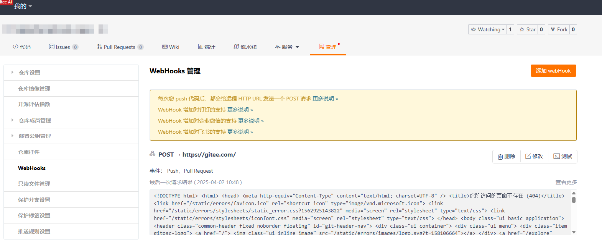

# 新增源码管理平台

当前版本已内置支持腾讯TGIT代码库，如已有其他平台SDK，则仅需补充适配模块即可，本文以[giteeSdk](https://gitee.com/sdk/gitee5j.git)为例，演示操作流程

参考：[项目结构介绍](./PROJECT_STRUCTURE.md)

## 1.指定服务提供者标识
````kotlin
/**
 * 源码管理平台提供者
 */
enum class ScmProviderCodes(val value: String) {
  TGIT("tgit"),
  TSVN("tsvn"),
  GITHUB("github"),
  GITLAB("gitlab"),
  GITEE("gitee");
}
````

## 2. 平台适配模块开发
此模块主要用于将对 [ devops-scm-sdk-{scmCode}] 模块与 [devops-scm-api] 模块以及第三方服务进行平滑对接，主要包含以下功能：
- [devops-scm-sdk] 模块的原始请求数据转化为 [devops-scm-api] 模块所定义的数据类型，
- 同时用于解析 webhook元数据 ，组装webhook触发参数以及关联的要素信息
- 将蓝盾平台的凭证转化为sdk支持的授权提供者

### 2.1 新建module
增加 devops-scm-provider-gitee-simple 模块，基于[devops-scm-provider/devops-scm-provider-git]目录右键 'New' -> 'Module'

### 2.2 增加授权适配器
为保障系统安全性，调用Gitee服务端API接口需进行身份认证。现针对Gitee社区版平台开发了授权提供者模块，当前版本支持以下两种授权机制：
- Oauth Access Token
- Personal Access Token


由于关联代码库时凭证类型不固定，因此需要针对gitee5j sdk进行授权适配，将代码库关联的授权信息注入到sdk内，目前针对gitee授权主要有三种：

| 授权类型  | 凭证类型                        | 凭证实体类                                            |
|-------|-----------------------------|----------------------------------------------------------------|
| OAUTH | oauth token                 | com.tencent.devops.scm.api.pojo.auth.AccessTokenScmAuth        |
| HTTP  | username + password + token | com.tencent.devops.scm.api.pojo.auth.TokenUserPassScmAuth      |
| SSH   | ssh private key + token     | com.tencent.devops.scm.api.pojo.auth.TokenSshPrivateKeyScmAuth |

蓝盾凭证实体类参考： com.tencent.devops.scm.api.pojo.auth.IScmAuth

````kotlin
package com.tencent.devops.scm.provider.gitee.simple.auth

import com.gitee.sdk.gitee5j.ApiClient
import com.gitee.sdk.gitee5j.auth.OAuth
import com.tencent.devops.scm.api.pojo.auth.AccessTokenScmAuth
import com.tencent.devops.scm.api.pojo.auth.IScmAuth
import com.tencent.devops.scm.api.pojo.auth.PersonalAccessTokenScmAuth
import com.tencent.devops.scm.api.pojo.auth.TokenSshPrivateKeyScmAuth
import com.tencent.devops.scm.api.pojo.auth.TokenUserPassScmAuth

class GiteeTokenAuthProviderAdapter(private val apiClient: ApiClient) {

  companion object {
    private const val AUTH_TYPE_OAUTH = "OAuth2"
  }

  fun withAuth(auth: IScmAuth) {
    val oAuth = apiClient.getAuthentication(AUTH_TYPE_OAUTH) as OAuth
    val token = when (auth) {
      is AccessTokenScmAuth -> auth.accessToken
      is PersonalAccessTokenScmAuth -> auth.personalAccessToken
      is TokenUserPassScmAuth -> auth.token
      is TokenSshPrivateKeyScmAuth -> auth.token
            else -> throw UnsupportedOperationException("gitAuth($auth) is not support")
    }
    oAuth.accessToken = token
  }
}

````

### 2.3 增加实体类转化工具类

目前 provider 模块有两种转化类：
- objectCovert: 将 [devops-scm-sdk-{scmCode}] 模块的原始数据对象转换为系统内部统一的数据模型对象

  参考：com.tencent.devops.scm.provider.git.tgit.TGitObjectConverter


- ObjectToMapConverter: 将 [devops-scm-sdk-{scmCode}] 模块的原始数据对象转换为Map<String, String>， 主要用于组装webhook触发变量

  参考：com.tencent.devops.scm.provider.git.tgit.TGitObjectToMapConverter

### 2.4 业务服务实现
在 [devops-scm-provider-gitee-simple] 模块下新建功能服务类实现 [devops-scm-api] 下的服务接口, 此处以 [仓库分支] 为例，实现RefService接口
````kotlin
package com.tencent.devops.scm.provider.gitee.simple

import com.gitee.sdk.gitee5j.ApiException
import com.gitee.sdk.gitee5j.api.RepositoriesApi
import com.gitee.sdk.gitee5j.model.Branch
import com.gitee.sdk.gitee5j.model.CompleteBranch
import com.tencent.devops.scm.api.RefService
import com.tencent.devops.scm.api.pojo.BranchListOptions
import com.tencent.devops.scm.api.pojo.Change
import com.tencent.devops.scm.api.pojo.Commit
import com.tencent.devops.scm.api.pojo.CommitListOptions
import com.tencent.devops.scm.api.pojo.ListOptions
import com.tencent.devops.scm.api.pojo.Reference
import com.tencent.devops.scm.api.pojo.ReferenceInput
import com.tencent.devops.scm.api.pojo.TagListOptions
import com.tencent.devops.scm.api.pojo.repository.ScmProviderRepository
import java.util.stream.Collectors

class GiteeRefService(private val giteeApiFactory: GiteeApiClientFactory) : RefService {

  override fun createBranch(repository: ScmProviderRepository, input: ReferenceInput) {
    throw UnsupportedOperationException("gitee template not support create branch")
  }

  override fun findBranch(repository: ScmProviderRepository, name: String): Reference {
    return GiteeApiTemplate.execute(
            repository,
            giteeApiFactory
    ) { repoName, client ->
            val repositoriesApi = RepositoriesApi(client)
      val completeBranch: CompleteBranch
      try {
        completeBranch = repositoriesApi.getReposOwnerRepoBranchesBranchWithHttpInfo(
                repoName.first,
                repoName.second,
                name
        ).data
      } catch (e: ApiException) {
        throw RuntimeException(e)
      }
      GiteeObjectConverter.convertBranches(completeBranch)
    }
  }

  override fun listBranches(repository: ScmProviderRepository, opts: BranchListOptions): List<Reference> {
    return GiteeApiTemplate.execute(
            repository,
            giteeApiFactory
    ) { repoName, client ->
            val repositoriesApi = RepositoriesApi(client)
      val branches: List<Branch>
      try {
        branches = repositoriesApi.getReposOwnerRepoBranchesWithHttpInfo(
                repoName.first,
                repoName.second,
                null,
                null,
                opts.page,
                opts.pageSize
        ).data
      } catch (e: ApiException) {
        throw RuntimeException(e)
      }
      // 结果转化
      branches.stream()
              .map { branch: Branch -> GiteeObjectConverter.convertBranches(branch) }
                .collect(Collectors.toList())
    }
  }

  override fun createTag(repository: ScmProviderRepository, input: ReferenceInput) {
    throw UnsupportedOperationException("gitee template not support create tag")
  }

  override fun findTag(repository: ScmProviderRepository, name: String): Reference {
    throw UnsupportedOperationException("gitee template not support find tag")
  }

  override fun listTags(repository: ScmProviderRepository, opts: TagListOptions): List<Reference> {
    throw UnsupportedOperationException("gitee template not support list tag")
  }

  override fun findCommit(repository: ScmProviderRepository, ref: String): Commit {
    throw UnsupportedOperationException("gitee template not support find commit")
  }

  override fun listCommits(repository: ScmProviderRepository, opts: CommitListOptions): List<Commit> {
    throw UnsupportedOperationException("gitee template not support list commit")
  }

  override fun listChanges(repository: ScmProviderRepository, ref: String, opts: ListOptions): List<Change> {
    throw UnsupportedOperationException("gitee template not support list change")
  }

  override fun compareChanges(
          repository: ScmProviderRepository,
          source: String,
          target: String,
          opts: ListOptions
    ): List<Change> {
    throw UnsupportedOperationException("gitee template not support compare changes")
  }
}

````

### 2.5 优化代码，适配不同服务域名
从上述代码可以看到，<u>创建apiClient对象</u>、<u>转化仓库名</u>以及<u>填充授权信息</u>的动作比较重复，可对此部分逻辑进行抽取，同时由于sdk预先指定了服务域名，导致在对接
不同Gitee服务时（社区版/专业版）不方便，所以在此处对上述代码进行优化，主要包含两部分内容
- 优化apiClient创建过程： 创建GiteeApiClientFactory类，采用工厂模式统一创建apiClient对象，将API客户端的创建与使用分离，服务类不需要关心API客户端的构建细节
- 统一异常捕获以及repoName转化过程：创建GiteeApiTemplate类，采用模板模式对异常捕获以及repoName转化过程进行封装

调整后的结果：

[GiteeApiClientFactory](../devops-scm-provider/devops-scm-provider-git/devops-scm-provider-gitee-simple/src/main/kotlin/com/tencent/devops/scm/provider/gitee/simple/GiteeApiClientFactory.kt)

[GiteeApiTemplate](../devops-scm-provider/devops-scm-provider-git/devops-scm-provider-gitee-simple/src/main/kotlin/com/tencent/devops/scm/provider/gitee/simple/GiteeApiTemplate.kt)

[优化后的 GiteeRefService](../devops-scm-provider/devops-scm-provider-git/devops-scm-provider-gitee-simple/src/main/kotlin/com/tencent/devops/scm/provider/gitee/simple/GiteeRefService.kt)

### 2.6 Webhook支持
### 2.7 Webhook支持
适配模块需对webhook元数据信息解析，并且转化为 [devops-scm-api] 模块所规定的webhook类型，在此以 gitee 代码库的 push 以及 pull_request webhook事件为例介绍webhook解析相关流程

#### 2.7.1 确认webhook消息体数据结构
随意注册一个webhook，然后执行相应动作，提取push/pull_request的webhook元数据，不同操作对应的webhook元数据可能不同


|事件类型| 触发webhook的动作                                      |
|----|---------------------------------------------------|
|push| - 新增/删除分支<br/>- 推送更新                              |
|pull_request| - 新增/编辑/关闭/重新打开/合并pull_request<br/>- 基于pr的源分支推送更新 |

提取到的webhook元数据可参考：
- [push事件](../devops-scm-provider/devops-scm-provider-git/devops-scm-provider-gitee/src/test/resources/push_webhook.json)


- [pull_request事件](../devops-scm-provider/devops-scm-provider-git/devops-scm-provider-gitee/src/test/resources/pull_request_webhook.json)

#### 2.7.2 构建 gitee webhook 实体类
根据 webhook 元数据在 [devops-scm-sdk-gitee-simple] 模块创建对应的push/pull_request实体类

webhook实体类命名规则：Gitee{事件类型}Event

webhook实体类下级实体类命名规则：GiteeEvent{要素名}

例如：
- GiteePullRequestEvent -- pull_request 事件 webhook事件实体类

- GiteePushEvent -- push 事件 webhook事件实体类

- GiteeEventRepository -- webhook事件仓库实体类

- GiteeEventCommit -- webhook事件提交实体类

#### 2.7.3 解析webhook
在 [devops-scm-provider-gitee] 模块下增加webhook解析器和增强器，分别实现两个接口
- [WebhookParser](../devops-scm-api/src/main/kotlin/com/tencent/devops/scm/api/WebhookParser.kt) : webhook解析器，主要用于校验webhook有效性，同时根据不同的webhook 事件组装对应的[Webhook](../devops-scm-api/src/main/java/com/tencent/devops/scm/api/pojo/webhook/Webhook.java)实体类
- [WebhookEnricher](../devops-scm-api/src/main/kotlin/com/tencent/devops/scm/api/WebhookEnricher.kt)：webhook增强器，由于webhook元数据中的信息可能不足以补全[Webhook](../devops-scm-api/src/main/java/com/tencent/devops/scm/api/pojo/webhook/Webhook.java)实体类内的字段，需要额外调用服务端API才能补充，补充操作可在enrich方法内实现

参考：
- [TGitWebhookEnricher](../devops-scm-provider/devops-scm-provider-git/devops-scm-provider-tgit/src/main/kotlin/com/tencent/devops/scm/provider/git/tgit/TGitWebhookEnricher.kt)
- [TGitWebhookParser](../devops-scm-provider/devops-scm-provider-git/devops-scm-provider-tgit/src/main/kotlin/com/tencent/devops/scm/provider/git/tgit/TGitWebhookParser.kt)

#### 2.7.4 服务挂载
以上功能完成后，为了便于后续集成 spring-boot 以及同时也对service类进行统一管控，可以对相关service类以及webhook解析类
进行集成，需继承抽象类 [GitScmProvider](../devops-scm-provider/devops-scm-provider-git/devops-scm-provider-git-common/src/main/java/com/tencent/devops/scm/provider/git/command/GitScmProvider.java)，对其抽象方法进行完善

参考：

[TGitScmProvider](../devops-scm-provider/devops-scm-provider-git/devops-scm-provider-tgit/src/main/kotlin/com/tencent/devops/scm/provider/git/tgit/TGitScmProvider.kt)

[GiteeScmProvider](../devops-scm-provider/devops-scm-provider-git/devops-scm-provider-gitee-simple/src/main/kotlin/com/tencent/devops/scm/provider/gitee/simple/GiteeScmProvider.kt)
## 3. spring-boot自动装配
本项目支持集成到第三方spring-boot项目中，核心代码位于[devops-scm-spring-boot-starter](../devops-scm-spring-boot-starter)模块，主要包含两块内容
- manager
  <br>
  对已支持代码源服务进行统一管理，实现[ScmProviderFactory](../devops-scm-spring-boot-starter/src/main/java/com/tencent/devops/scm/spring/manager/ScmProviderFactory.java)接口，采用工厂模式创建具体的Provider，连接器相关配置
  可通过上层springboot进行注入，源码实现可参考：
  <br>
  [GiteeScmProviderFactory](../devops-scm-spring-boot-starter/src/main/java/com/tencent/devops/scm/spring/manager/GiteeScmProviderFactory.java)
  <br>
  [TGitScmProviderFactory](../devops-scm-spring-boot-starter/src/main/java/com/tencent/devops/scm/spring/manager/TGitScmProviderFactory.java)
- config
  <br>
  为了上层SpringBoot项目能对相关Provider进行自动装配，需创建springboot-configuration，对相关Provider进行挂载，
  相关源码可参考[ScmProviderConfiguration](../devops-scm-spring-boot-starter/src/main/java/com/tencent/devops/scm/spring/config/ScmProviderConfiguration.java)，服务挂载完毕后，还需对将相关Configuration类的全类名记录到[META-INF](../devops-scm-spring-boot-starter/src/main/resources/META-INF/spring/org.springframework.boot.autoconfigure.AutoConfiguration.imports)，以便
  上层SpringBoot项目能识别需要加载的Configuration类，从而自动创建Provider相关的bean对象